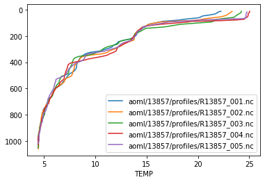

# argopandas

[](https://github.com/ArgoCanada/argopandas/actions/workflows/check.yaml)
[](https://codecov.io/gh/ArgoCanada/argopandas?branch=master)
[](https://pypi.org/project/argopandas/)
[](https://argocanada.github.io/argopandas/released)
[](https://github.com/ArgoCanada/argopandas)

The goal of argopandas is to provide seamless access to Argo NetCDF files using a pandas `DataFrame`-based interface. It is a Python port of the [argodata package for R](https://github.com/ArgoCanada/argodata). The package is under heavy development and we would love feedback on the interface or anything else about the package!

## Installation

You can install the `argopandas` package using `pip`.

``` bash
pip install argopandas
```

The package depends on `pandas`, `numpy`, `netCDF4`, and `pyarrow`, which install automatically if using `pip` or you can install also your favourite Python package manager. The `argopandas` package requires Python 3.6 or later.

## Examples

The intended interface for most usage is contained in the `argopandas` module. You can import this as `argo` for pretty-looking syntax:


```python
import argopandas as argo
```

The global indexes are available via `argo.prof`, `argo.meta`, `argo.tech`, `argo.traj`, `argo.bio_prof`, `argo.synthetic_prof`, and `argo.bio_traj`.


```python
argo.meta.head(5)
```


<div>

<table border="1" class="dataframe">
  <thead>
    <tr style="text-align: right;">
      <th></th>
      <th>file</th>
      <th>profiler_type</th>
      <th>institution</th>
      <th>date_update</th>
    </tr>
  </thead>
  <tbody>
    <tr>
      <th>0</th>
      <td>aoml/13857/13857_meta.nc</td>
      <td>845</td>
      <td>AO</td>
      <td>2018-10-11 20:00:14+00:00</td>
    </tr>
    <tr>
      <th>1</th>
      <td>aoml/13858/13858_meta.nc</td>
      <td>845</td>
      <td>AO</td>
      <td>2018-10-11 20:00:15+00:00</td>
    </tr>
    <tr>
      <th>2</th>
      <td>aoml/13859/13859_meta.nc</td>
      <td>845</td>
      <td>AO</td>
      <td>2018-10-11 20:00:25+00:00</td>
    </tr>
    <tr>
      <th>3</th>
      <td>aoml/15819/15819_meta.nc</td>
      <td>845</td>
      <td>AO</td>
      <td>2018-10-11 20:00:16+00:00</td>
    </tr>
    <tr>
      <th>4</th>
      <td>aoml/15820/15820_meta.nc</td>
      <td>845</td>
      <td>AO</td>
      <td>2018-10-11 20:00:18+00:00</td>
    </tr>
  </tbody>
</table>
</div>


By defaut, downloads are lazily cached from the [Ifremer https mirror](https://data-argo.ifremer.fr). You can use `argo.url_mirror()` or `argo.file_mirror()` with `argo.set_default_mirror()` to point `argopandas` at your favourite copy of Argo.

To get Argo data from one or more NetCDF files, subset the indexes and use one of the table accessors to download, cache, and read variables aligned along common dimensions. The accessor you probably want is the `.levels` accessor from the `argo.prof` index:


```python
argo.prof.head(5).levels[['PRES', 'TEMP']]
```

    Downloading 5 files from 'https://data-argo.ifremer.fr/dac/aoml/13857/profiles'
    Reading 5 files
                                                                                        


<div>

<table border="1" class="dataframe">
  <thead>
    <tr style="text-align: right;">
      <th></th>
      <th></th>
      <th></th>
      <th>PRES</th>
      <th>TEMP</th>
    </tr>
    <tr>
      <th>file</th>
      <th>N_PROF</th>
      <th>N_LEVELS</th>
      <th></th>
      <th></th>
    </tr>
  </thead>
  <tbody>
    <tr>
      <th rowspan="5" valign="top">aoml/13857/profiles/R13857_001.nc</th>
      <th rowspan="5" valign="top">0</th>
      <th>0</th>
      <td>11.900000</td>
      <td>22.235001</td>
    </tr>
    <tr>
      <th>1</th>
      <td>17.000000</td>
      <td>21.987000</td>
    </tr>
    <tr>
      <th>2</th>
      <td>22.100000</td>
      <td>21.891001</td>
    </tr>
    <tr>
      <th>3</th>
      <td>27.200001</td>
      <td>21.812000</td>
    </tr>
    <tr>
      <th>4</th>
      <td>32.299999</td>
      <td>21.632000</td>
    </tr>
    <tr>
      <th>...</th>
      <th>...</th>
      <th>...</th>
      <td>...</td>
      <td>...</td>
    </tr>
    <tr>
      <th rowspan="5" valign="top">aoml/13857/profiles/R13857_005.nc</th>
      <th rowspan="5" valign="top">0</th>
      <th>102</th>
      <td>976.500000</td>
      <td>4.527000</td>
    </tr>
    <tr>
      <th>103</th>
      <td>986.700012</td>
      <td>4.527000</td>
    </tr>
    <tr>
      <th>104</th>
      <td>996.799988</td>
      <td>4.533000</td>
    </tr>
    <tr>
      <th>105</th>
      <td>1007.000000</td>
      <td>4.487000</td>
    </tr>
    <tr>
      <th>106</th>
      <td>1017.200012</td>
      <td>4.471000</td>
    </tr>
  </tbody>
</table>
<p>551 rows × 2 columns</p>
</div>


You can get data from every variable in an Argo NetCDF file using one of these accessors. The variables grouped in each are aligned along the same dimensions and are documented together in the Argo user's manual.

- All indexes have a `.info` accessor that contains length-one variables that aren't aligned along any dimensions
- `argo.prof`: `argo.prof.levels`, `arog.prof.prof`, `argo.prof.calib`, `argo.prof.param`, and `argo.prof.history`
- `argo.traj`: `argo.traj.cycle`, `argo.traj.measurement`, `argo.traj.param`, and `argo.traj.history`
- `argo.tech`: `argo.tech.tech_param`
- `argo.meta`: `argo.meta.config_param`, `argo.meta.missions`, `argo.meta.trans_system`, `argo.meta.positioning_system`, `argo.meta.launch_config_param`, `argo.meta.sensor`, and `argo.meta.param`

Once you have a data frame you do anything you'd do with a regular `pd.DataFrame()`, like plot your data using the built-in plot method:


```python
import matplotlib.pyplot as plt
fig, ax = plt.subplots()
for label, df in argo.prof.head(5).levels.groupby('file'):
    df.plot(x='TEMP', y = 'PRES', ax=ax, label=label)
ax.invert_yaxis()
```

    Reading 5 files
                                                                                        


    

    


You can access all the index files for a particular float using `argo.float()`, which lazily filters all the indexes for a particular float ID.


```python
float_obj = argo.float(13857)
float_obj.meta.info
```

    Downloading 'https://data-argo.ifremer.fr/ar_index_global_meta.txt.gz'
    Downloading 'https://data-argo.ifremer.fr/dac/aoml/13857/13857_meta.nc'
    Reading 1 file
                                                                                        


<div>

<table border="1" class="dataframe">
  <thead>
    <tr style="text-align: right;">
      <th></th>
      <th></th>
      <th>DATA_TYPE</th>
      <th>FORMAT_VERSION</th>
      <th>HANDBOOK_VERSION</th>
      <th>DATE_CREATION</th>
      <th>DATE_UPDATE</th>
      <th>PLATFORM_NUMBER</th>
      <th>PTT</th>
      <th>PLATFORM_FAMILY</th>
      <th>PLATFORM_TYPE</th>
      <th>PLATFORM_MAKER</th>
      <th>...</th>
      <th>LAUNCH_QC</th>
      <th>START_DATE</th>
      <th>START_DATE_QC</th>
      <th>STARTUP_DATE</th>
      <th>STARTUP_DATE_QC</th>
      <th>DEPLOYMENT_PLATFORM</th>
      <th>DEPLOYMENT_CRUISE_ID</th>
      <th>DEPLOYMENT_REFERENCE_STATION_ID</th>
      <th>END_MISSION_DATE</th>
      <th>END_MISSION_STATUS</th>
    </tr>
    <tr>
      <th>file</th>
      <th></th>
      <th></th>
      <th></th>
      <th></th>
      <th></th>
      <th></th>
      <th></th>
      <th></th>
      <th></th>
      <th></th>
      <th></th>
      <th></th>
      <th></th>
      <th></th>
      <th></th>
      <th></th>
      <th></th>
      <th></th>
      <th></th>
      <th></th>
      <th></th>
      <th></th>
    </tr>
  </thead>
  <tbody>
    <tr>
      <th>aoml/13857/13857_meta.nc</th>
      <th>0</th>
      <td>Argo meta-data</td>
      <td>3.1</td>
      <td>1.2</td>
      <td>20181011200014</td>
      <td>20181011200014</td>
      <td>13857</td>
      <td>09335                                         ...</td>
      <td>FLOAT                                         ...</td>
      <td>PALACE</td>
      <td>WRC                                           ...</td>
      <td>...</td>
      <td>b'1'</td>
      <td>19970719163000</td>
      <td>b'1'</td>
      <td>19970719103000</td>
      <td>b'1'</td>
      <td>R/V Seward Johnson</td>
      <td>97-03</td>
      <td>CTD 108                                       ...</td>
      <td></td>
      <td>NaN</td>
    </tr>
  </tbody>
</table>
<p>1 rows × 43 columns</p>
</div>


