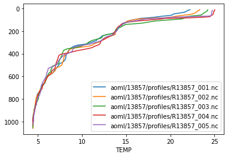

argopandas
==========

|Check| |Codecov test coverage| |argopandas on PyPi| |Documentation|
|argopandas on GitHub|

The goal of argopandas is to provide seamless access to Argo NetCDF
files using a pandas ``DataFrame``-based interface. It is a Python port
of the `argodata package for
R <https://github.com/ArgoCanada/argodata>`__. The package is under
heavy development and we would love feedback on the interface or
anything else about the package!

Installation
------------

You can install the ``argopandas`` package from `PyPI <>`__ or
`conda-forge <>`__.

.. code:: bash

   pip install argopandas
   conda install --channel=conda-forge argopandas

The package depends on ``pandas``, ``numpy``, ``netCDF4``, and
``pyarrow``, which install automatically if using ``pip`` or
``conda install``. The ``argopandas`` package requires Python 3.6 or
later.

Examples
--------

The intended interface for most usage is contained in the ``argopandas``
module. You can import this as ``argo`` for pretty-looking syntax:

.. |Check| image:: https://github.com/ArgoCanada/argopandas/actions/workflows/check.yaml/badge.svg
   :target: https://github.com/ArgoCanada/argopandas/actions/workflows/check.yaml
.. |Codecov test coverage| image:: https://codecov.io/gh/ArgoCanada/argopandas/branch/master/graph/badge.svg
   :target: https://codecov.io/gh/ArgoCanada/argopandas?branch=master
.. |argopandas on PyPi| image:: https://pypip.in/v/argopandas/badge.svg
   :target: https://pypi.org/project/argopandas/
.. |Documentation| image:: https://img.shields.io/badge/Documentation-released-yellow
   :target: https://argocanada.github.io/argopandas/released
.. |argopandas on GitHub| image:: https://img.shields.io/badge/GitHub-ArgoCanada%2Fargopandas-blue
   :target: https://github.com/ArgoCanada/argopandas

.. code:: ipython3

    import argopandas as argo

The global indexes are available via ``argo.prof``, ``argo.meta``,
``argo.tech``, ``argo.traj``, ``argo.bio_prof``,
``argo.synthetic_prof``, and ``argo.bio_traj``.

.. code:: ipython3

    argo.meta.head(5)

.. raw:: html

    

    
    <table border="1" class="dataframe">
      <thead>
        <tr style="text-align: right;">
          <th></th>
          <th>file</th>
          <th>profiler_type</th>
          <th>institution</th>
          <th>date_update</th>
        </tr>
      </thead>
      <tbody>
        <tr>
          <th>0</th>
          <td>aoml/13857/13857_meta.nc</td>
          <td>845</td>
          <td>AO</td>
          <td>2018-10-11 20:00:14+00:00</td>
        </tr>
        <tr>
          <th>1</th>
          <td>aoml/13858/13858_meta.nc</td>
          <td>845</td>
          <td>AO</td>
          <td>2018-10-11 20:00:15+00:00</td>
        </tr>
        <tr>
          <th>2</th>
          <td>aoml/13859/13859_meta.nc</td>
          <td>845</td>
          <td>AO</td>
          <td>2018-10-11 20:00:25+00:00</td>
        </tr>
        <tr>
          <th>3</th>
          <td>aoml/15819/15819_meta.nc</td>
          <td>845</td>
          <td>AO</td>
          <td>2018-10-11 20:00:16+00:00</td>
        </tr>
        <tr>
          <th>4</th>
          <td>aoml/15820/15820_meta.nc</td>
          <td>845</td>
          <td>AO</td>
          <td>2018-10-11 20:00:18+00:00</td>
        </tr>
      </tbody>
    </table>
    

By defaut, downloads are lazily cached from the `Ifremer https
mirror <https://data-argo.ifremer.fr>`__. You can use
``argo.url_mirror()`` or ``argo.file_mirror()`` with
``argo.set_default_mirror()`` to point ``argopandas`` at your favourite
copy of Argo.

To get Argo data from one or more NetCDF files, subset the indexes and
use one of the table accessors to download, cache, and read variables
aligned along common dimensions. The accessor you probably want is the
``.levels`` accessor from the ``argo.prof`` index:

.. code:: ipython3

    argo.prof.head(5).levels[['PRES', 'TEMP']]

.. parsed-literal::

    Downloading 5 files from 'https://data-argo.ifremer.fr/dac/aoml/13857/profiles'
    Reading 5 files

.. raw:: html

    

    
    <table border="1" class="dataframe">
      <thead>
        <tr style="text-align: right;">
          <th></th>
          <th></th>
          <th></th>
          <th>PRES</th>
          <th>TEMP</th>
        </tr>
        <tr>
          <th>file</th>
          <th>N_PROF</th>
          <th>N_LEVELS</th>
          <th></th>
          <th></th>
        </tr>
      </thead>
      <tbody>
        <tr>
          <th rowspan="5" valign="top">aoml/13857/profiles/R13857_001.nc</th>
          <th rowspan="5" valign="top">0</th>
          <th>0</th>
          <td>11.900000</td>
          <td>22.235001</td>
        </tr>
        <tr>
          <th>1</th>
          <td>17.000000</td>
          <td>21.987000</td>
        </tr>
        <tr>
          <th>2</th>
          <td>22.100000</td>
          <td>21.891001</td>
        </tr>
        <tr>
          <th>3</th>
          <td>27.200001</td>
          <td>21.812000</td>
        </tr>
        <tr>
          <th>4</th>
          <td>32.299999</td>
          <td>21.632000</td>
        </tr>
        <tr>
          <th>...</th>
          <th>...</th>
          <th>...</th>
          <td>...</td>
          <td>...</td>
        </tr>
        <tr>
          <th rowspan="5" valign="top">aoml/13857/profiles/R13857_005.nc</th>
          <th rowspan="5" valign="top">0</th>
          <th>102</th>
          <td>976.500000</td>
          <td>4.527000</td>
        </tr>
        <tr>
          <th>103</th>
          <td>986.700012</td>
          <td>4.527000</td>
        </tr>
        <tr>
          <th>104</th>
          <td>996.799988</td>
          <td>4.533000</td>
        </tr>
        <tr>
          <th>105</th>
          <td>1007.000000</td>
          <td>4.487000</td>
        </tr>
        <tr>
          <th>106</th>
          <td>1017.200012</td>
          <td>4.471000</td>
        </tr>
      </tbody>
    </table>
    
551 rows × 2 columns

    

You can get data from every variable in an Argo NetCDF file using one of
these accessors. The variables grouped in each are aligned along the
same dimensions and are documented together in the Argo user’s manual.

-  All indexes have a ``.info`` accessor that contains length-one
   variables that aren’t aligned along any dimensions
-  ``argo.prof``: ``argo.prof.levels``, ``arog.prof.prof``,
   ``argo.prof.calib``, ``argo.prof.param``, and ``argo.prof.history``
-  ``argo.traj``: ``argo.traj.cycle``, ``argo.traj.measurement``,
   ``argo.traj.param``, and ``argo.traj.history``
-  ``argo.tech``: ``argo.tech.tech_param``
-  ``argo.meta``: ``argo.meta.config_param``, ``argo.meta.missions``,
   ``argo.meta.trans_system``, ``argo.meta.positioning_system``,
   ``argo.meta.launch_config_param``, ``argo.meta.sensor``, and
   ``argo.meta.param``

Once you have a data frame you do anything you’d do with a regular
``pd.DataFrame()``, like plot your data using the built-in plot method:

.. code:: ipython3

    import matplotlib.pyplot as plt
    fig, ax = plt.subplots()
    for label, df in argo.prof.head(5).levels.groupby('file'):
        df.plot(x='TEMP', y = 'PRES', ax=ax, label=label)
    ax.invert_yaxis()

.. parsed-literal::

    Reading 5 files

You can access all the index files for a particular float using
``argo.float()``, which lazily filters all the indexes for a particular
float ID.

.. code:: ipython3

    float_obj = argo.float(13857)
    dict(float_obj.meta.info.iloc[0])

.. parsed-literal::

    Reading 1 file

.. parsed-literal::

    {'DATA_TYPE': 'Argo meta-data  ',
     'FORMAT_VERSION': '3.1 ',
     'HANDBOOK_VERSION': '1.2 ',
     'DATE_CREATION': '20181011200014',
     'DATE_UPDATE': '20181011200014',
     'PLATFORM_NUMBER': '13857   ',
     'PTT': '09335                                                                                                                                                                                                                                                           ',
     'PLATFORM_FAMILY': 'FLOAT                                                                                                                                                                                                                                                           ',
     'PLATFORM_TYPE': 'PALACE                          ',
     'PLATFORM_MAKER': 'WRC                                                                                                                                                                                                                                                             ',
     'FIRMWARE_VERSION': '012797                          ',
     'MANUAL_VERSION': '012797          ',
     'FLOAT_SERIAL_NO': '28                              ',
     'STANDARD_FORMAT_ID': 'n/a             ',
     'DAC_FORMAT_ID': 'PALACE_T1       ',
     'WMO_INST_TYPE': '845 ',
     'PROJECT_NAME': 'ACCE (Atlantic Circulation and Climate Experiment)              ',
     'DATA_CENTRE': 'AO',
     'PI_NAME': 'BOB MOLINARI                                                    ',
     'ANOMALY': 'n/a                                                                                                                                                                                                                                                             ',
     'BATTERY_TYPE': 'Alkaline                                                        ',
     'BATTERY_PACKS': 'board -  1 (s/n: 32);                                           ',
     'CONTROLLER_BOARD_TYPE_PRIMARY': 'n/a                             ',
     'CONTROLLER_BOARD_TYPE_SECONDARY': 'n/a                             ',
     'CONTROLLER_BOARD_SERIAL_NO_PRIMARY': '32                              ',
     'CONTROLLER_BOARD_SERIAL_NO_SECONDARY': 'n/a                             ',
     'SPECIAL_FEATURES': 'n/a                                                                                                                                                                                                                                                                                                                                                                                                                                                                                                                                                                                                                                                                                                                                                                                                                                                                                                                                                                                                                                                             ',
     'FLOAT_OWNER': 'BOB MOLINARI                                                    ',
     'OPERATING_INSTITUTION': 'NOAA, AOML, Miami                                               ',
     'CUSTOMISATION': 'n/a                                                                                                                                                                                                                                                                                                                                                                                                                                                                                                                                                                                                                                                                                                                                                                                                                                                                                                                                                                                                                                                             ',
     'LAUNCH_DATE': '19970719145500',
     'LAUNCH_LATITUDE': 0.007516666781157255,
     'LAUNCH_LONGITUDE': -15.013999938964844,
     'LAUNCH_QC': b'1',
     'START_DATE': '19970719163000',
     'START_DATE_QC': b'1',
     'STARTUP_DATE': '19970719103000',
     'STARTUP_DATE_QC': b'1',
     'DEPLOYMENT_PLATFORM': 'R/V Seward Johnson              ',
     'DEPLOYMENT_CRUISE_ID': '97-03                           ',
     'DEPLOYMENT_REFERENCE_STATION_ID': 'CTD 108                                                                                                                                                                                                                                                         ',
     'END_MISSION_DATE': '              ',
     'END_MISSION_STATUS': nan}

